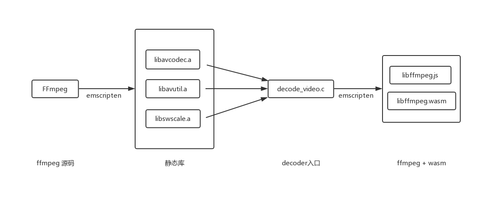
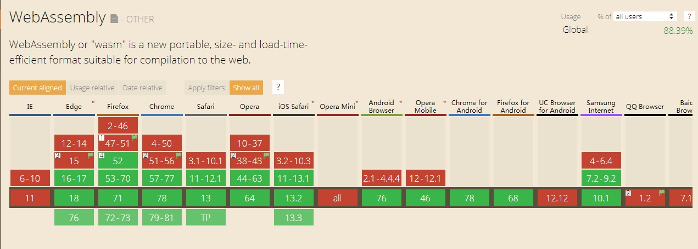
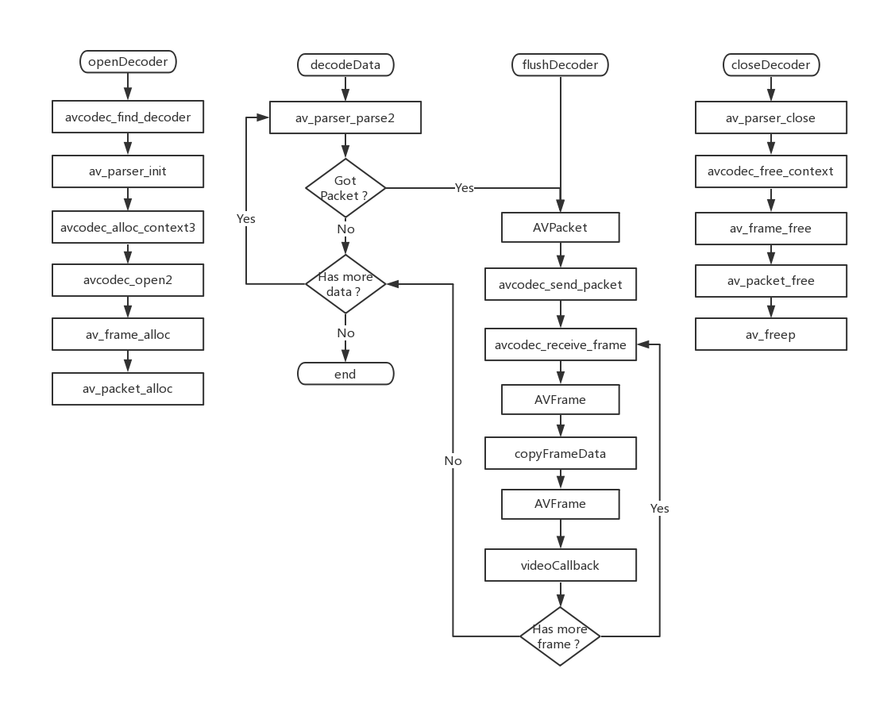

# 1 简介

借助于WebAssembly(简称Wasm)技术，实现在浏览器端调用ffmpeg接口完成H.265码流到YUV数据的解码。
总体流程如下：



# 2 依赖

## 2.1 [WebAssembly (Wasm)](https://webassembly.org/)

按照官网的定义，WebAssembly (wasm) 是一个可移植、体积小、加载快并且兼容 Web 的全新格式。通过wasm，可以在浏览器里执行原生代码(例如C、C++)。
目前，wasm技术已经得到主流浏览器的广泛支持（数据来源[Can I Use](https://www.caniuse.com/#search=WebAssembly)）。


## 2.2 FFmpeg

FFmpeg是一套可以用来记录、转换数字音频、视频，并能将其转化为流的开源计算机程序。采用LGPL或GPL许可证。它提供了录制、转换以及流化音视频的完整解决方案。我们代码里主要使用FFmpeg来做解码（decode）。为了减小体积，最终编译生成的wasm里包含的是裁剪过的FFmpeg，主要包含以下几个库：

- libavcodec： 编解码（最重要的库）
- libavutil： 工具库（大部分库都需要这个库的支持）
- libswscale： 视频像素数据格式转换

# 3 具体实现

## 3.1 接口

编译生成的wasm文件对外提供四个接口：

- openDecoder：初始化解码器；
- decodeData：解码传入的H.265码流数据；
- flushDecoder：清空缓存数据；
- closeDecoder：关闭解码器；

## 3.2 实现细节

解码过程中使用到的FFmpeg API及解码流程如下图所示：


## 3.3 如何使用

最终的编译结果是两个文件，一个是包含ffmpeg库的wasm文件，另一个是胶水代码(js文件)。页面里引用js文件时，胶水代码会加载wasm。
Javascript与WASM的数据交互：


```js
// 发送：
var cacheBuffer = Module._malloc(data.length);
Module.HEAPU8.set(data, cacheBuffer);
var ret = Module._decodeData(cacheBuffer, data.length, pts);

// 接收：
var videoSize = 0;
var videoCallback = Module.addFunction(function (addr_y, addr_u, addr_v, stride_y, stride_u, stride_v, width, height, pts) {
    console.log("[%d]In video callback, size = %d * %d, pts = %d", ++videoSize, width, height, pts)
    let out_y = HEAPU8.subarray(addr_y, addr_y + stride_y * height)
    let out_u = HEAPU8.subarray(addr_u, addr_u + (stride_u * height) / 2)
    let out_v = HEAPU8.subarray(addr_v, addr_v + (stride_v * height) / 2)
    let buf_y = new Uint8Array(out_y)
    let buf_u = new Uint8Array(out_u)
    let buf_v = new Uint8Array(out_v)
    let data = new Uint8Array(buf_y.length + buf_u.length + buf_v.length)
    data.set(buf_y, 0)
    data.set(buf_u, buf_y.length)
    data.set(buf_v, buf_y.length + buf_u.length)
    var obj = {
        data: data,
        width,
        height
    }
    displayVideoFrame(obj);
});
var codecType = 1; // 0 - H.264, 1 - H.265
var ret = Module._openDecoder(codecType, videoCallback, LOG_LEVEL_WASM)
// 需要把回调通过openDecoder方法传入C层，在C层调用。
```

# 4 编译

## 4.1 安装Wasm工具链Emscripten

安装步骤可参考其[官方文档](https://emscripten.org/docs/getting_started/downloads.html)，目前支持 Windows, MacOS, Linux。

建议版本：1.38.45， 编译运行都没问题。

## 4.2 下载FFmpeg

```bash
mkdir goldvideo
cd goldvideo
git clone https://git.ffmpeg.org/ffmpeg.git
cd ffmpeg
git checkout -b 4.1 origin/release/4.1
```

这里切到了4.1分支。

## 4.3 下载本文的代码

保证FFmpeg目录和代码目录平级。

```bash
git clone http://github.com/goldvideo/decoder_wasm.git
cd decoder_wasm

目录结构：

├─goldvideo
│  ├─ffmpeg
│  ├─decoder_wasm
```

## 4.4 编译

进入代码目录，根据需要，以下命令三选一执行：

```bash
./build_decoder_264.sh      //支持解码 H.264
./build_decoder_265.sh      //支持解码 H.265
./build_decoder_264_265.sh  //支持解码 H.264 和 H.265
```

# 5 测试

## 5.1 WebGL

H5使用Canvas来绘图，但是默认的2d模式只能绘制RGB格式，使用FFmpeg解码出来的视频数据是YUV格式，想要渲染出来需要进行颜色空间转换，可以使用FFmpeg的libswscale模块进行转换。
为了提升性能，这里使用了WebGL来硬件加速，主要参考了这个项目，做了一些修改： https://github.com/p4prasoon/YUV-Webgl-Video-Player

## 5.2 启动：

```bash
npm install
npm start
```

## 5.3 测试页面：

```
http://localhost:3000/test/main.html
```

# 6 参考项目

[WasmVideoPlayer](https://github.com/sonysuqin/WasmVideoPlayer).

[https://github.com/goldvideo/decoder_wasm](https://github.com/goldvideo/decoder_wasm "https://github.com/goldvideo/decoder_wasm")

# webrtc_H265player
QQ: 365603975 JOIN US
